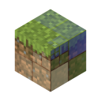

# Blendium

Alpha blending for Distant Horizons and Sodium!

## Dependencies

### Required

- [Fabric API](https://modrinth.com/mod/fabric-api) or [Quilt Standard Libraries](https://modrinth.com/mod/qsl)
- [Sodium](https://modrinth.com/mod/sodium)

### Optional

- [Distant Horizons](https://modrinth.com/mod/distanthorizons): blends nicely with the LODs from Distant Horizons
- [Iris](https://modrinth.com/mod/iris): Blendium has shaderpack presets for using Distant Horizons with Iris shaderpacks. Currently supports Distant Horizons' LOD brightness and saturation settings, as well as a water reflection color shader modification for Distant Horizons. When Iris isn't present the options for the shaderpack `(off)` in the config file are used

## Incompatibilities

- Forge forks of Sodium (Rubidium, Magnesium, Embeddium, etc.)
- Forge forks of Iris (Oculus)

[Create an issue](https://github.com/Steveplays28/blendium/issues/new) on the issue tracker if you've found an incompatibility!

## Download

See the version info in the filename for the supported Minecraft versions.  
Made for the Fabric and Quilt modloaders.  
Client side.

## FAQ

- Q: Will you be backporting this to lower Minecraft versions?  
  A: No.

- Q: Forge pls?  
  A: Also no.

## License

This project is licensed under LGPLv3, see [LICENSE](LICENSE).
